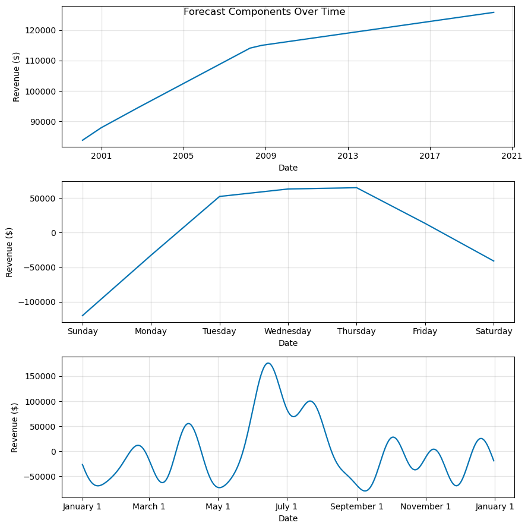
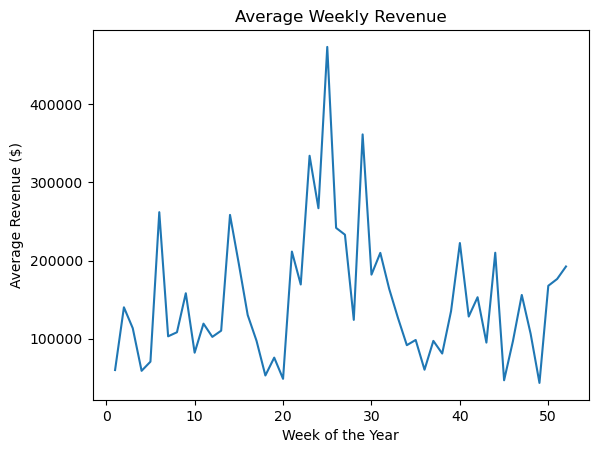
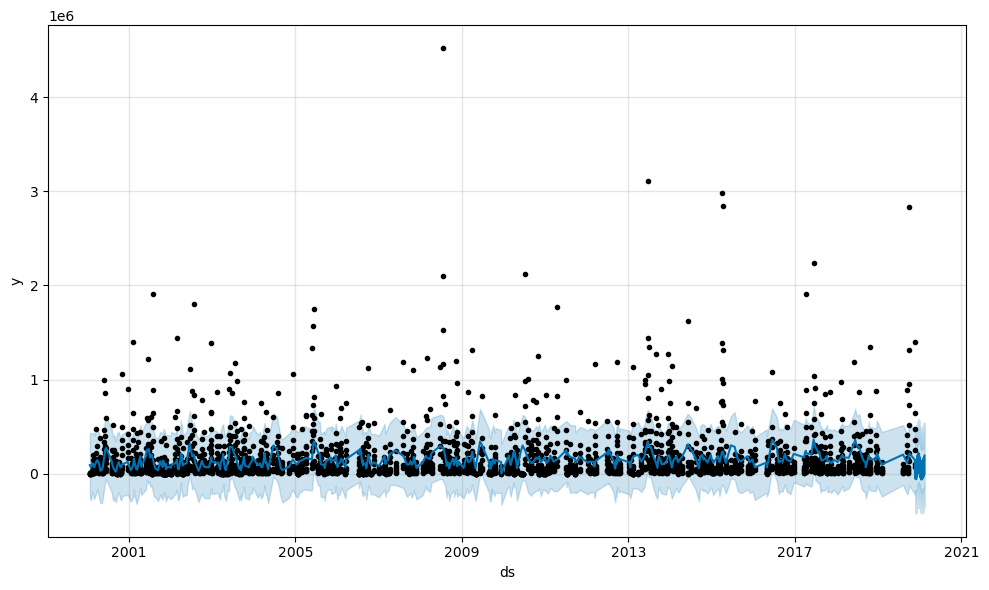
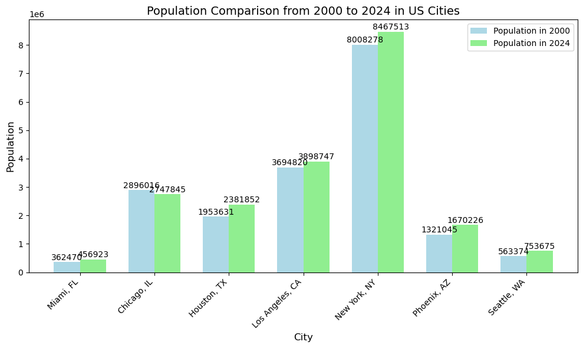
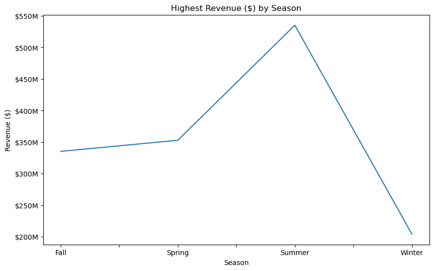
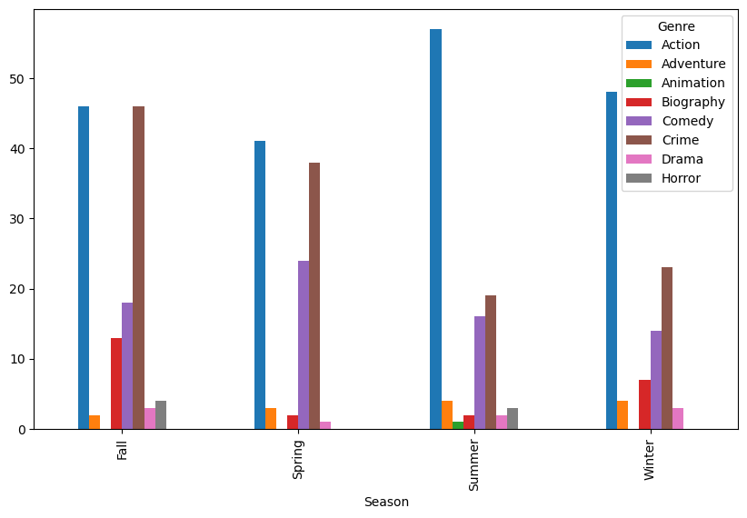
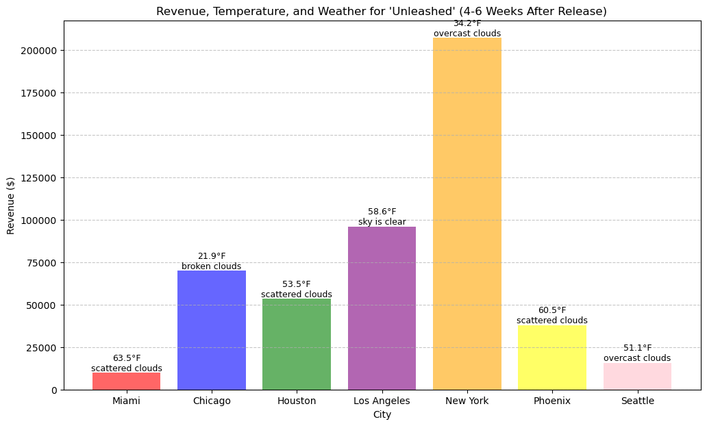
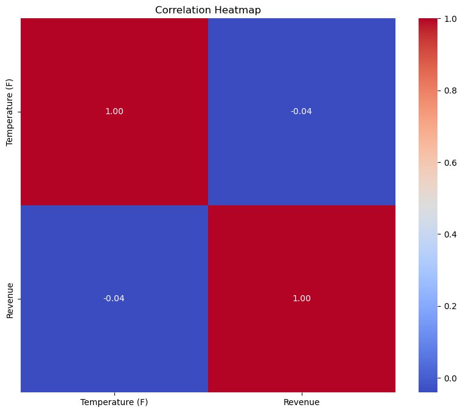

# i-tickets
```
Have you ever wondered why certain movies are advertised during certain times of year, have you ever wondered why there are so many certain types of movies or why there certain ratings seem to be more prevalent? Well look no further, i-tickets is here to give you the scoop, the 411, the dirt, and all those detail things on what you may or may not have noticed about the movie-going experience. SO without further ado, let's get started...
```


# Table of Content
- [Data Usage and Project Overview](#data-usage-and-project-overview)
- [Seasonal Analysis](#seasonal-analysis)
- [Data Forecasting](#data-forecasting)
- [Correlation of Genre to Season](#correlation-of-genre-to-season)
- [Correlation of Temperature to Revenue](#correlation-of-temperature-to-revenue)
- [Trend, Viewership, and Population Data Analysis](#trend-viewership-and-population-data-analysis)
- [Trends](#trends)
- [Viewrship and Ticket Sale Peaks](#viewrship-and-ticket-sale-peaks)
- [Conclusion and Future Consideration](#conclusion-and-future-consideration)
- [Summary](#summary)
- [References](#references)
- [For More Information](#for-more-information)

# Data Usage and Project Overview

We used 6 movie datatsets from Kaggle, one historial weather dataset from Open Weather

We chose to examine twenty years of data between the years 2000 through 2020. We opted not to go into 2020 as we knew our data would be skewed due to COViD. 

We decided to focus on a few major cities; Los Angeles, New York, Seattle, Houston, Miami, Chicago and Phoenix. We chose these cities as the weather varies as do population and our thought process was that we would cover all bases for environment.

# Seasonal Analysis






Peak Revenue:  Weeks 25–30 (late June to July) are the most profitable, 
      driven by summer blockbusters.

Decline:  Revenues dip after summer, with moderate fluctuations 
      for the rest of the year.

Year-End Recovery:  Weeks 50–52 show a smaller spike due to holiday releases.

Seasonal Patterns:  Summer and holiday seasons are peak periods, while spring and early fall generate lower revenues.

Conclusion:  Movie revenues peak during summer and holidays. Distributors should prioritize major releases in these periods to maximize earnings.

# Data Forecasting 



- Trends: The model shows a stable forecast that aligns closely with most actual revenue data. This indicates its ability to accurately capture general patterns in movie performance across different seasons and years. The model effectively identifies consistent year-over-year trends, such as the dominance of certain genres and the predictable seasonality in audience preferences.

- Outliers: While the model performs well overall, occasional extreme spikes in revenue, such as those observed in 2008 and 2014, represent notable exceptions. These spikes correspond to blockbuster releases that significantly exceed predicted revenue. Such outliers highlight the influence of major, highly anticipated films that resonate broadly with audiences, often accompanied by expansive marketing campaigns and franchise appeal.

- Model Accuracy: The model demonstrates strong predictive capabilities for standard revenue patterns, but its performance diminishes in the face of unexpected blockbuster successes. The difficulty in predicting such spikes suggests a need to incorporate additional factors, such as pre-release hype, social media trends, and franchise momentum, into the forecasting process.

- Conclusion: The model is effective at predicting overall revenue trends and stable patterns in the movie industry. However, to enhance its utility, it must be refined to account for outlier events like blockbuster releases. Integrating data on pre-release buzz, franchise history, and marketing strategies could improve its ability to forecast exceptional revenue spikes, making it a more robust tool for industry planning.






Graph A: Yearly Revenue Patterns
The steady increase in movie revenues over two decades can be attributed to several factors. Inflation has driven up ticket prices, while growing audiences, fueled by population growth and expanding access to theaters, have boosted overall revenue. The emergence of premium formats, such as IMAX and 3D, and additional revenue from higher-priced luxury theaters have also contributed to this upward trend.

Graph B: Weekly Revenue Patterns
Weekly revenue peaks on Thursdays, coinciding with preview screenings for highly anticipated new releases. These early showings generate excitement and capture eager moviegoers, driving significant revenue. Interestingly, revenue dips on Fridays and Saturdays, which could reflect a shift as some audiences opt for Thursday previews or delay weekend plans for more flexible entertainment options. These trends highlight the strategic importance of Thursday releases to maximize opening-weekend revenue.

Graph C: Seasonal Revenue Trends
Revenue spikes in July (summer) and December (holidays) align with major blockbuster release schedules. The summer months capitalize on school vacations and relaxed schedules, while the holiday season benefits from festive family gatherings and end-of-year releases targeting award nominations. Conversely, January and April experience noticeable dips, likely due to post-holiday fatigue and fewer high-profile releases.

Chart 2 & 3: Population Growth and Revenue
An upward trend in both movie revenues and population numbers from 2000 to 2024 supports the connection between increased population and higher audience turnout. As populations grow, so does the potential moviegoing audience, further driving revenue growth. This is amplified by technological advancements in distribution, such as online ticketing and global simultaneous releases, making movies more accessible to larger audiences.

Conclusion:
Over the past two decades, movie revenues have shown consistent growth due to inflation, rising ticket prices, audience expansion, and advancements in theater experiences. Weekly patterns reveal Thursday as a pivotal day for revenue, highlighting its importance for opening-weekend strategy. Seasonal spikes in summer and holidays reinforce these periods as the most profitable, driven by blockbuster scheduling and cultural habits. Together, these insights underline the value of strategic planning in release timing and audience engagement to sustain and amplify revenue growth.


# Correlation of Genre to Season


(Genres According To Season)

### The top 5 genres are, in that respect order: Action, Crime, Comedy, Drama,  and Adventure

As seen in the chart above: 
- During Fall:  Action and crime are tied for the highest viewed genres, with comedy as the second highest, biographies 3rd, horror 4th, drama 5th, and adventure 6th

- During Spring:  Action is the highest viewed genre, crime is the second, comedy the 3rd, adventure 4th, biography 5th, and drama 6th

- During Summer: Action is the highest viewed genre, crime is the second, comedy the 3rd, adventure 4th, horror 5th, drama and biography tie for 6th, and animation 7th

- During Winter:  Action is the highest viewed genre, crime is the second, comedy the 3rd, biography 4th, Adventure 5th, and drama 6th


Conclusion:

This Genre Analyisis clearly showcases the viewing habits of movie audiences, tends to favor Action across all seasons, with crime following closely behind and at times matching. These genres maintain broad appeal throughout the year, suggesting a steady demand for high-energy and suspenseful narratives.
Comedy consistently ranks third across seasons, indicating a year-round preference for lighthearted entertainment. These patterns can guide studios and theaters in scheduling releases to maximize audience engagement and revenue.

Note: In summer we see the appearance of both horror, and animation. An assumption could be made that perhaps audiences due to having more free time are more willing to entertain a wider genre range. 


# Correlation of Temperature to Revenue



### Bar Graph (Revenue, Temperature, and Weather) 
 - New York generates the highest 
 revenue despite cold, overcast weather, while Miami, with warmer weather, shows 
 the lowest revenue. Revenue does not appear to directly correlate with temperature or weather conditions, as cities with diverse weather patterns display varying revenue levels.

### Heatmap (Temperature and Revenue Correlation)
 - The correlation between temperature and revenue is -0.04, indicating no meaningful relationship.
 Temperature has minimal to no impact on movie revenues, reinforcing that other factors (e.g., marketing, audience size) drive revenue differences.

Conclusion:

Both graphs suggest that weather and temperature have little to no influence on movie revenues. 


# Trends


(Trends)

# Viewership and Ticket Sale Peaks


(Viewership and Ticket Sale Peaks)

# Population


(Population)

# Trend, Viewership, and Population Data Analysis

Graph A: Movie Revenues (2000–2020)
The steady increase in movie revenues over two decades can be attributed to several factors. Inflation has driven up ticket prices, while growing audiences, fueled by population growth and expanding access to theaters, have boosted overall revenue. The emergence of premium formats, such as IMAX and 3D, and additional revenue from higher-priced luxury theaters have also contributed to this upward trend.

Graph B: Weekly Revenue Patterns
Weekly revenue peaks on Thursdays, coinciding with preview screenings for highly anticipated new releases. These early showings generate excitement and capture eager moviegoers, driving significant revenue. Interestingly, revenue dips on Fridays and Saturdays, which could reflect a shift as some audiences opt for Thursday previews or delay weekend plans for more flexible entertainment options. These trends highlight the strategic importance of Thursday releases to maximize opening-weekend revenue.

Graph C: Seasonal Revenue Trends
Revenue spikes in July (summer) and December (holidays) align with major blockbuster release schedules. The summer months capitalize on school vacations and relaxed schedules, while the holiday season benefits from festive family gatherings and end-of-year releases targeting award nominations. Conversely, January and April experience noticeable dips, likely due to post-holiday fatigue and fewer high-profile releases.

Chart 1 & 3: Population Growth and Revenue
An upward trend in both movie revenues and population numbers from 2000 to 2024 supports the connection between increased population and higher audience turnout. As populations grow, so does the potential moviegoing audience, further driving revenue growth. This is amplified by technological advancements in distribution, such as online ticketing and global simultaneous releases, making movies more accessible to larger audiences.

Conclusion:
Over the past two decades, movie revenues have shown consistent growth due to inflation, rising ticket prices, audience expansion, and advancements in theater experiences. Weekly patterns reveal Thursday as a pivotal day for revenue, highlighting its importance for opening-weekend strategy. Seasonal spikes in summer and holidays reinforce these periods as the most profitable, driven by blockbuster scheduling and cultural habits. Together, these insights underline the value of strategic planning in release timing and audience engagement to sustain and amplify revenue growth.


# Conclusion and Future Consideration

Conclusion
While weather has minimal impact, holidays and seasonality are key drivers of revenue. Releasing genre-specific films—Action in summer and Comedy in winter holidays—optimizes box office success. 


# Summary

- Weather Impact
Weather has minimal influence on revenues, with trends driven more by demographics and marketing rather than temperature or cloud cover.  
- Holidays
Ticket sales peak during summer blockbusters (late June–July) and year-end holidays (weeks 50–52), driven by leisure time and gatherings.  
- Seasonal Trends
Summer and winter holidays are the most profitable, while spring and fall see moderate sales due to fewer high-profile releases. 
- Actor Influence
Leading actors like Christian Bale, Sandra Bullock, and Joaquin Phoenix drive higher revenues, while Leonardo DiCaprio and Anthony Hopkins show weaker performance due to niche film choices.  

- Popular Genres
Action and Comedy consistently generate the highest revenues.  

- Seasonal Distribution
Summer: Action and Comedy dominate, benefiting from blockbuster timing.  
Winter: Comedy and Crime thrive, aligning with holiday-themed content.  
Spring/Fall:** A balanced mix of Drama, Action, and other genres contribute moderately.  

- Holiday-Specific
Family-friendly genres, such as Comedy and Animation, excel during holidays. 


# For More Information

If you have any additional questions, feel free to connect with us at 
[Armand Araujo LinkedIn](https://www.linkedin.com/in/armand-araujo-a82ba2291/).
[Misha Hedman  LinkedIn](MISS MISHA)
[Mei Kam Bharadwaj LinkedIn](MISS MEI)
[Laetitia Germe-Jones LinkedIn](MISS LAETITIA)


Also, be sure to check out our Githubs: 

[Armand Araujo Github](https://github.com/Armand57araujo)

[Misha Hedman Github](https://github.com/MishaHedman)

[Mei Kam Bharadwaj Github](https://github.com/meikaykam)

[Laetitia Germe-Jones Github](https://github.com/Laetitia5)


# Repository Structure

    
```
├── images
├── Resources
    └── Resources/daily_weather_2000_2020.csv
    └── Resources/merged_movies_weather.csv
├── pythonnotebook.ipynb
└── README.md
```